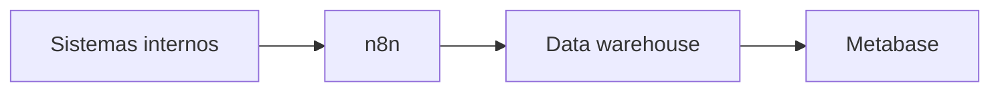

# Matheus Correa

Coordenador de TI na [Belluno Tecnologia](https://github.com/belluno-company), em Caçapava do Sul, RS. Formado em Análise e Desenvolvimento de Sistemas.

Estou na Belluno desde 2017. Entrei como operador no call center de suporte a provedores, fui para a supervisão, depois para o desenvolvimento (já com infra no dia a dia) e hoje coordeno o setor. Trabalho com produtos internos em Laravel, React e TypeScript, e com a operação de TI da empresa: dados, telefonia, rede, cloud, Proxmox e o parque para mais de 100 pessoas, incluindo licenças, certificados e terceiros.

Nos dados, os sistemas internos alimentam um warehouse via n8n e a apresentação fica no Metabase. O ambiente e os indicadores não são públicos; o que dá para mostrar é o desenho:

O que posso mostrar em público:

**[Pódio Belluno](https://github.com/matheus-scorrea/podio-belluno)** (Laravel API + React), sistema de metas e indicadores em [podio.belluno.com.br](https://podio.belluno.com.br).

`PHP` `Laravel` `React` `TypeScript` `PostgreSQL` `Docker` `n8n` `Metabase` `AWS` `Proxmox` `MikroTik` `Asterisk` `SIP`
